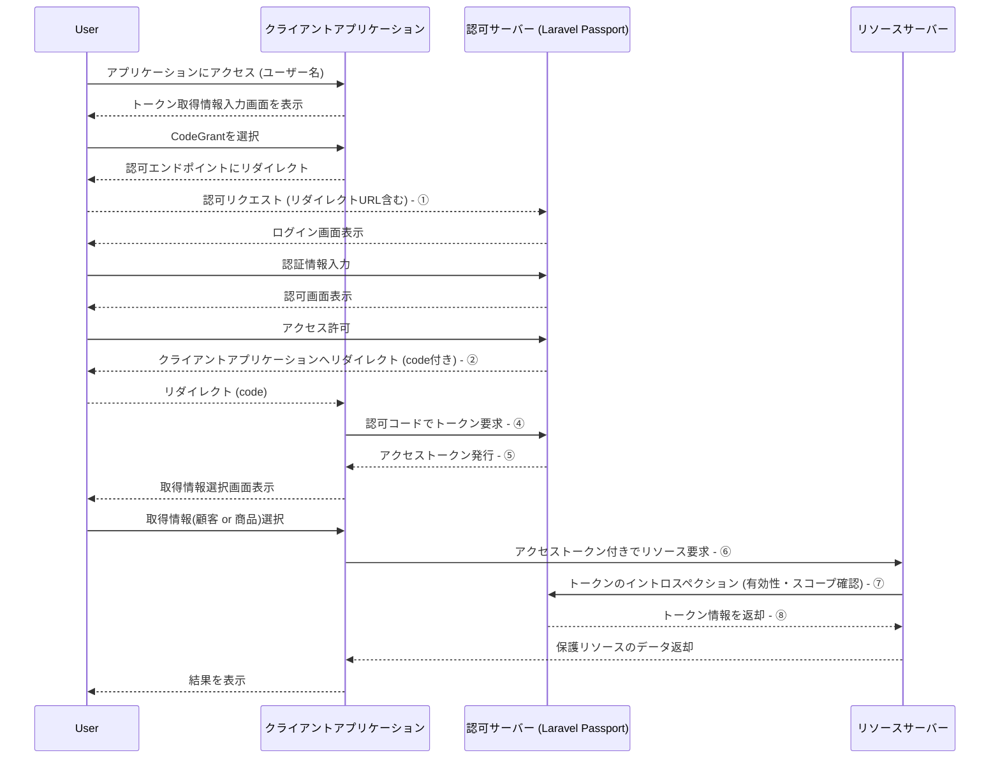

# laravel-oauth

## Over View
OAuth2プロセス学習用プロジェクト

## Details
OAuth2の認可サーバー、リソースサーバー、クライアントアプリケーションをそれぞれ別のコンテナで構築し、学習用に利用する。

### データ配置
それぞれに配置されているデータは下記の通り。

- 認可サーバー (Laravel Passport を利用)
  - ユーザー
  - ロール
  - スコープ
  - パーミッション
  - OAuth2クライアント
    - PasswordGrant用クライアント
    - CodeGrant用クライアント
    - リソースサーバー用クライアント
- リソースサーバー
  - 顧客情報
  - 商品情報
- クライアントアプリケーション
  - ユーザートークン(認可プロセス中に取得する情報)

### プロジェクト前提
認可プロセスにおけるプロジェクト挙動の前提は下記の通り

- 認可サーバーで実装されている認可方式は下記の通り
  - CodeGrant(認可コードグラント)を利用した認可プロセス
  - PasswordGrant(パスワードグラント)を利用した認可プロセス
- 認可サーバーは下記インターフェースを提供
  - CodeGrant(Code取得用)用ユーザー認証Web画面
  - CodeGrant用トークン取得API 
  - PasswordGrant用トークン取得API
  - イントロスペクションAPI
- 各ユーザーには下記のロールが割り当てられる
  - 管理者(manager)
    - 全てのリソースにアクセス可能
  - 一般ユーザー(staff)
    - 商品情報のみアクセス可能
- ロールに関連してユーザーに割り当てられるスコープは下記の通り
  - 管理者(manager) : confidential(機密情報)
  - 一般ユーザー(staff) : general(一般情報)
- ロールに関連してユーザーに割り当てられるパーミッションは下記の通り
  - 管理者(manager) : read, write, delete
  - 一般ユーザー(staff) : read
- リソースサーバーは下記インターフェースを提供
  - 顧客情報取得API
  - 商品情報取得API
- リソースサーバーから認可サーバーへのイントロスペクションAPIは、認可状況の確認が必要になった都度リクエストされる。(商用利用の場合はキャッシュ利用を推奨)
- クライアントアプリケーションは認可プロセス確認用ツールの位置付けのため、認証機能は実装されていない。


### 認可プロセス
このプロジェクトにおける認可プロセスの流れは下記の通り。

#### PasswordGrant


#### CodeGrant


### リクエスト例
#### ① 認可リクエスト (リダイレクトURL含む)
```html
http://localhost.auth-app.sample.jp/oauth/authorize?client_id=4&redirect_uri=http%3A%2F%2Flocalhost.client-app.sample.jp%2Fauth%2Fcallback&response_type=code&scope=&state=stateDummy
```

#### ② アクライアントアプリケーションへリダイレクト (code付き)
```html
http://localhost.client-app.sample.jp/auth/callback?code=def...a56&state=stateDummy
```

#### ③ Password Grantでトークン要求 (username/password)
PasswordGrant用クライアントにリクエスト
```shell
curl -i -X POST http://localhost.auth-app.sample.jp/oauth/token \
  -H "Content-Type: application/json" \
  -d '{
    "grant_type": "password",
    "client_id": "1",
    "client_secret": "2Oi***uV2",
    "username": "manager@test.com",
    "password": "password123",
    "scope": "*"
}'
```

#### ④ 認可コードでトークン要求
CodeGrant用クライアントにリクエスト
```shell
curl -X POST http://localhost.auth-app.sample.jp/oauth/token \
  -H "Content-Type: application/json" \
  -d '{
    "grant_type": "authorization_code",
    "client_id": "2",
    "client_secret": "pti***v6B",
    "redirect_uri": "http://localhost.client-app.sample.jp/auth/callback",
    "code": "def...a56"
}'
```

#### ⑤ アクセストークン発行
```json
{
  "token_type": "Bearer",
  "expires_in": 1296000,
  "access_token": "eyJ***n0k",
  "refresh_token": "def***36e"
}
```

#### ⑥ アクセストークン付きでリソース要求
```shell
curl -X GET http://localhost.resource-app.sample.jp/api/customers \
  -H "Authorization: Bearer eyJ***n0k"
```

#### ⑦ トークンのイントロスペクション (有効性・スコープ確認)
リソースサーバー用クライアントにリクエスト
```shell
curl -X POST http://localhost.auth-app.sample.jp/api/oauth/introspect \
  -H "Authorization: Basic $(echo -n '3:yig***9HH' | base64)" \
  -H "Content-Type: application/json" \
  -d '{"token": "eyJ***n0k"}'
```

#### ⑧ トークン情報を返却
ここで応答される`client_id`はトークン要求時のクライアントID
```json
{
  "active": true,
  "client_id": 2,
  "username": "manager@test.com",
  "permissions": ["read", "write", "delete"],
  "scopes": ["confidential", "general"],
  "exp": 1780317075,
  "sub": 1,
  "iss": "http://localhost.auth-app.sample.jp",
  "token_type": "access_token"
}
```

## composition
- リバースプロキシ
  - Nginx 
- 認可サーバー
  - (バックエンド共通)
  - Breeze
  - Inertia
  - Vue3
- リソースサーバー
  - (バックエンド共通)
- クライアントアプリケーション
  - (バックエンド共通)
  - Inertia
  - Vue3
- バックエンド共通
  - Nginx
  - Laravel 
- その他
  - MySQL
  - Docker
  - Redis

## install and Usage
### 1. コンテナビルド
```shell
docker compose build
```

### 2. 初期設定のためにコンテナ起動
```shell
docker compose up -d auth-server auth-db resource-server resource-db client-server client-db
```

### 3. 初期設定(バックエンドアプリケーション環境)
#### 認可サーバー
```shell
docker compose exec auth-server bash
composer install
cp -p /var/www/app/.env.example /var/www/app/.env
php artisan key:generate
php artisan passport:install
exit
```

#### リソースサーバー
```shell
docker compose exec resource-server bash
composer install
cp -p /var/www/app/.env.example /var/www/app/.env
php artisan key:generate
exit
````

#### クライアントアプリケーション
```shell
docker compose exec client-server bash
composer install
cp -p /var/www/app/.env.example /var/www/app/.env
php artisan key:generate
exit
````

※フロントアプリケーションのインストールは[後続作業](#7-全コンテナ起動)でnodeコンテナ起動時に自動で実行されるため割愛

### 4. 初期設定(データベース設定)
#### 認可サーバー
```shell
docker compose exec auth-db bash
mysql -u root -proot -e "CREATE USER 'laravelUser' IDENTIFIED BY 'password000'"
mysql -u root -proot -e "GRANT all ON *.* TO 'laravelUser'"
mysql -u root -proot -e "FLUSH PRIVILEGES"
mysql -u root -proot -e "CREATE DATABASE auth_management"
exit
```
```shell
docker compose exec auth-server bash
php artisan migrate:fresh --seed
exit
```

#### リソースサーバー
```shell
docker compose exec resource-db bash
mysql -u root -proot -e "CREATE USER 'laravelUser' IDENTIFIED BY 'password000'"
mysql -u root -proot -e "GRANT all ON *.* TO 'laravelUser'"
mysql -u root -proot -e "FLUSH PRIVILEGES"
mysql -u root -proot -e "CREATE DATABASE resource_management"
exit
```
```shell
docker compose exec resource-server bash
php artisan migrate:fresh --seed
exit
```

#### クライアントアプリケーション
```shell
docker compose exec client-db bash
mysql -u root -proot -e "CREATE USER 'laravelUser' IDENTIFIED BY 'password000'"
mysql -u root -proot -e "GRANT all ON *.* TO 'laravelUser'"
mysql -u root -proot -e "FLUSH PRIVILEGES"
mysql -u root -proot -e "CREATE DATABASE client_management"
exit
```
```shell
docker compose exec client-server bash
php artisan migrate:fresh --seed
exit
```

### 5. hosts設定
hosts に下記エントリーを追加
```shell
127.0.0.1 localhost.auth-app.sample.jp
127.0.0.1 localhost.auth-node.sample.jp
127.0.0.1 localhost.resource-app.sample.jp
127.0.0.1 localhost.resource-node.sample.jp
127.0.0.1 localhost.client-app.sample.jp
127.0.0.1 localhost.client-node.sample.jp
```

### 6. コンテナ停止
```shell
docker compose down
```

### 7. 全コンテナ起動
```shell
docker compose up -d
```

### 8. コンテナ確認
```shell
docker ps
docker compose ps
```

### 9. OAuthクライアント作成
```shell
docker compose exec auth-server bash
```

PasswordGrant用クライアントを作成
```shell
php artisan passport:client --password

 What should we name the password grant client? [Laravel Password Grant Client]:
 > PasswordGrantClient

 Which user provider should this client use to retrieve users? [users]:
  [0] users
 > 

   INFO  Password grant client created successfully.  

  Client ID ...................................................................................................................................... 1  
  Client secret ........................................................................................... 2Oi**********************************uV2 
```

CodeGrant用クライアントを作成
```shell
php artisan passport:client

 Which user ID should the client be assigned to? (Optional):
 > 

 What should we name the client?:
 > CodeGrantClient

 Where should we redirect the request after authorization? [http://localhost.auth-app.sample.jp/auth/callback]:
 > http://localhost.client-app.sample.jp/auth/callback

   INFO  New client created successfully.  

  Client ID ...................................................................................................................................... 2  
  Client secret ........................................................................................... pti**********************************v6B
```

クライアントアプリケーション用クライアントを作成
```shell
php artisan passport:client --client

 What should we name the client? [Laravel ClientCredentials Grant Client]:
 > ResourceServerClient

   INFO  New client created successfully.  

  Client ID ...................................................................................................................................... 3  
  Client secret ........................................................................................... yig**********************************9HH 
```

```shell
exit
```

### 10. OAuthクライアント情報をアプリケーションに設定
#### リソースサーバー
`resource-app/.env`の下記エントリーに、作成したクライアント情報を設定。
```env
INTROSPECTION_CLIENT_ID=(リソースサーバー用クライアントID)
INTROSPECTION_CLIENT_SECRET=(リソースサーバー用クライアントシークレット)
```

#### クライアントアプリケーション
`client-app/.env`の下記エントリーに、作成したクライアント情報を設定。
```env
AUTH_PASSWORD_GRANT_CLIENT_ID=(PasswordGrant用クライアントID)
AUTH_PASSWORD_GRANT_CLIENT_SECRET=(PasswordGrant用クライアントシークレット)

AUTH_CODE_GRANT_CLIENT_ID=(CodeGrant用クライアントID)
AUTH_CODE_GRANT_CLIENT_SECRET=(CodeGrant用クライアントシークレット)
```

### 11. Webアプリケーションログイン
#### 認可サーバー
```
http://localhost.auth-app.sample.jp/login
```

##### 管理者
```
Email : manager@test.com
Password : password123
```

##### 一般ユーザー
```
Email : staff@test.com
Password : password123
```

#### クライアントアプリケーション
```
http://localhost.client-app.sample.jp/
```

##### 管理者
```
ユーザー名 : manager@test.com
PasswordGrant用パスワード : password123
```

##### 一般ユーザー
```
ユーザー名 : staff@test.com
PasswordGrant用パスワード : password123
```

### 12. 構築時メモ
構築時にインストールした主要パッケージ

#### 認可サーバー
Laravel, breeze, inertia, vue3
```shell
composer create-project laravel/laravel:^12 --prefer-dist .
composer require laravel/breeze:2.3.6
php artisan breeze:install vue
```

laravel/passport最新(少なくともver.13.0.2)はpassport:installでエラーになるため、バージョンを指定してインストールする。
```shell
composer require laravel/passport "12.4.2"
```

#### リソースサーバー
Laravel
```shell
composer create-project laravel/laravel:^12 --prefer-dist .
```

#### クライアントアプリケーション
Laravel
```shell
composer create-project laravel/laravel:^12 --prefer-dist .
```

blade+vue運用ではなくInertia+vue3運用
```shell
composer require inertiajs/inertia-laravel
```
```shell
npm install vue@3 @inertiajs/inertia @inertiajs/vue3 @vitejs/plugin-vue
```